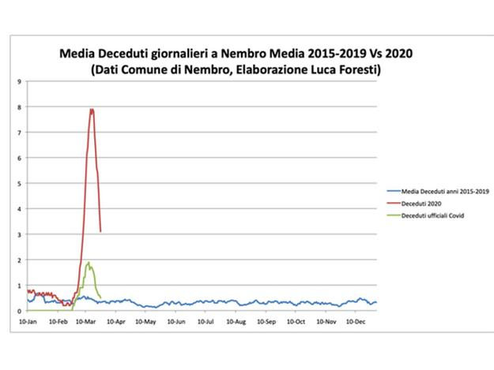

```{r setup, echo=FALSE}
options(htmltools.dir.version = FALSE)
source("../setup.R", chdir = TRUE)
```

```{R, echo=FALSE, out.width="100%"}
url = "https://raw.githubusercontent.com/pcm-dpc/COVID-19/master/dati-andamento-nazionale/dpc-covid19-ita-andamento-nazionale.csv"
COVID19IT <- read.csv(file = url, stringsAsFactors = FALSE)
COVID19IT$data <- as.Date(COVID19IT$data)
data = data.frame(date = COVID19IT$data,
                  y = COVID19IT$totale_casi)
data$x = as.numeric(data$date) - min(as.numeric(data$date)) + 1

## Exponential
mod1_start = lm(log(y) ~ x, data = data)
b = unname(coef(mod1_start))
start = list(th1 = exp(b[1]), th2 = b[2])
exponential <- function(x, th1, th2) th1 * exp(th2 * x)
mod1 = nls(y ~ exponential(x, th1, th2), data = data, start = start)

## Logistic
mod2 = nls(y ~ SSlogis(x, Asym, xmid, scal), data = data)

## Gompertz 
mod3 = nls(y ~ SSgompertz(x, Asym, b2, b3), data = data)

## Predictions
df = data.frame(x = seq(min(data$x), max(data$x)+7))
df = cbind(df, date = as.Date(df$x, origin = data$date[1]-1),
               fit1 = predict(mod1, newdata = df),
               fit2 = predict(mod2, newdata = df),
               fit3 = predict(mod3, newdata = df))
ylim = c(0, max(df[,c("fit2", "fit3")]))

ggplot(data, aes(x = date, y = y)) + 
  geom_point() +
  geom_line(data = df, aes(x = date, y = fit1, color = "Exponential")) +
  geom_line(data = df, aes(x = date, y = fit2, color = "Logistic")) +
  geom_line(data = df, aes(x = date, y = fit3, color = "Gompertz")) +
  coord_cartesian(ylim = ylim) +
  labs(x = "", y = "Totale positivi", color = "Model") +
  ggtitle("Italia") +
  scale_y_continuous(breaks = seq(0, max(ylim), by = 10000),
                     minor_breaks = seq(0, max(ylim), by = 5000)) +
  scale_x_date(date_breaks = "2 day", date_labels =  "%b%d",
               minor_breaks = "1 day") +
  scale_color_manual(values = cols) +
  theme_bw() +
  theme(legend.position = "bottom",  
        axis.text.x = element_text(angle=60, hjust=1))
# ggsave("figura1.jpg", width = 8, height = 7)
```

---

```{R, echo=FALSE, out.width="100%"}
url = "https://raw.githubusercontent.com/pcm-dpc/COVID-19/master/dati-regioni/dpc-covid19-ita-regioni.csv"
COVID19U <- read.csv(file = url, stringsAsFactors = FALSE)
COVID19U$data <- as.Date(COVID19U$data)
COVID19U <- subset(COVID19U, denominazione_regione == "Umbria")
data = data.frame(date = COVID19U$data,
                  y = COVID19U$totale_casi)
data = subset(data, y > 0)
data$x = as.numeric(data$date) - min(as.numeric(data$date)) + 1

## Exponential
mod1_start = lm(log(y) ~ x, data = data)
b = unname(coef(mod1_start))
start = list(th1 = exp(b[1]), th2 = b[2])
exponential <- function(x, th1, th2) th1 * exp(th2 * x)
mod1 = nls(y ~ exponential(x, th1, th2), data = data, start = start)

## Logistic
mod2 = nls(y ~ SSlogis(x, Asym, xmid, scal), data = data)

## Gompertz 
mod3 = nls(y ~ SSgompertz(x, Asym, b2, b3), data = data)

## Predictions
df = data.frame(x = seq(min(data$x), max(data$x)+7))
df = cbind(df, date = as.Date(df$x, origin = data$date[1]-1),
               fit1 = predict(mod1, newdata = df),
               fit2 = predict(mod2, newdata = df),
               fit3 = predict(mod3, newdata = df))
ylim = c(0, max(df[,c("fit2", "fit3")]))

ggplot(data, aes(x = date, y = y)) + 
  geom_point() +
  geom_line(data = df, aes(x = date, y = fit1, color = "Exponential")) +
  geom_line(data = df, aes(x = date, y = fit2, color = "Logistic")) +
  geom_line(data = df, aes(x = date, y = fit3, color = "Gompertz")) +
  coord_cartesian(ylim = ylim) +
  labs(x = "", y = "Totale positivi", color = "Model") +
  ggtitle("Umbria") +
  scale_y_continuous(breaks = seq(0, max(ylim), by = 100),
                     minor_breaks = seq(0, max(ylim), by = 50)) +
  scale_x_date(date_breaks = "2 day", date_labels =  "%b%d",
               minor_breaks = "1 day") +
  scale_color_manual(values = cols) +
  theme_bw() +
  theme(legend.position = "bottom",  
        axis.text.x = element_text(angle=60, hjust=1))
# ggsave("figura2.jpg", width = 8, height = 7)
```

---

```{r, echo=FALSE}
data = data.frame(date = COVID19IT$data,
                  tamponi = c(NA, diff(COVID19IT$tamponi)),
                  positivi = c(NA, diff(COVID19IT$totale_casi)))
data$x = as.numeric(data$date) - min(as.numeric(data$date)) + 1
data$r = data$positivi/data$tamponi
data = subset(data, tamponi > 50)
data_IT = data
```

```{r, echo=FALSE, fig.width = 7, fig.height = 6, out.width="100%"}
ggplot(data, aes(x = date)) + 
  geom_point(aes(y = tamponi, color = "tamponi"), pch = 19) +
  geom_line(aes(y = tamponi, color = "tamponi")) +
  geom_point(aes(y = positivi, color = "positivi"), pch = 15) +
  geom_line(aes(y = positivi, color = "positivi")) +
  labs(x = "", y = "Numero di casi", color = "") +
  ggtitle("Italia") +
  scale_x_date(date_breaks = "2 day", date_labels =  "%b%d",
               minor_breaks = "1 day") +
  scale_color_manual(values = palette()[c(2,1)]) +
  theme_bw() +
  theme(legend.position = "bottom",
        axis.text.x = element_text(angle=60, hjust=1))
```

---

```{r, echo=FALSE, fig.width = 7, fig.height = 6, out.width="100%"}
ggplot(data, aes(x = date, y = r)) + 
  geom_smooth(method = "loess", se = TRUE, col = palette()[4]) +
  geom_point() + geom_line(size = 0.5) +
  ggtitle("Italia") +
  labs(x = "", y = "Positivi / Tamponi") +
  coord_cartesian(ylim = c(0, max(data$r))) +
  scale_y_continuous(labels = scales::percent_format(),
                     minor_breaks = seq(0.05, 1, by = 0.05)) +
  scale_x_date(date_breaks = "2 day", date_labels =  "%b%d",
               minor_breaks = "1 day") +
  theme_bw() +
  theme(axis.text.x = element_text(angle=60, hjust=1))
```

---

```{r, echo=FALSE}
data = data.frame(date = COVID19U$data,
                  tamponi = c(NA, diff(COVID19U$tamponi)),
                  positivi = c(NA, diff(COVID19U$totale_casi)))
data$x = as.numeric(data$date) - min(as.numeric(data$date)) + 1
data$r = data$positivi/data$tamponi
data = subset(data, tamponi > 50)
data_U = data
```

```{r, echo=FALSE, fig.width = 7, fig.height = 6, out.width="100%"}
ggplot(data, aes(x = date)) + 
  geom_point(aes(y = tamponi, color = "tamponi"), pch = 19) +
  geom_line(aes(y = tamponi, color = "tamponi")) +
  geom_point(aes(y = positivi, color = "positivi"), pch = 15) +
  geom_line(aes(y = positivi, color = "positivi")) +
  labs(x = "", y = "Numero di casi", color = "") +
  ggtitle("Umbria") +
  scale_x_date(date_breaks = "2 day", date_labels =  "%b%d",
               minor_breaks = "1 day") +
  scale_color_manual(values = palette()[c(2,1)]) +
  theme_bw() +
  theme(legend.position = "bottom",
        axis.text.x = element_text(angle=60, hjust=1))
```

---

```{r, echo=FALSE, fig.width = 7, fig.height = 6, out.width="100%"}
ggplot(data, aes(x = date, y = r)) + 
  geom_smooth(method = "loess", se = TRUE, col = palette()[3]) +
  geom_point() + geom_line(size = 0.5) +
  ggtitle("Umbria") +
  labs(x = "", y = "Positivi / Tamponi") +
  coord_cartesian(ylim = c(0, max(data$r))) +
  scale_y_continuous(labels = scales::percent_format(),
                     minor_breaks = seq(0.05, 1, by = 0.05)) +
  scale_x_date(date_breaks = "2 day", date_labels =  "%b%d",
               minor_breaks = "1 day") +
  theme_bw() +
  theme(axis.text.x = element_text(angle=60, hjust=1))
```

---

```{r, echo=FALSE, fig.width = 7, fig.height = 6, out.width="100%"}
data = rbind(data.frame(data_IT, type = "Italia"),
             data.frame(data_U, type = "Umbria"))

ggplot(data, aes(x = date, y = r, group = type, col = type)) + 
  geom_point(col=1) + geom_line(col=1, size = 0.5) +
  geom_smooth(method = "loess", se = TRUE) +
  labs(x = "", y = "Positivi / Tamponi") +
  scale_y_continuous(labels = scales::percent_format(),
                     minor_breaks = seq(0.05, 1, by = 0.05)) +
  scale_x_date(date_breaks = "2 day", date_labels =  "%b%d",
               minor_breaks = "1 day") +
  scale_color_manual(values = palette()[c(4,3)]) +
  coord_cartesian(ylim = c(0, max(data$r))) +
  theme_bw() +
  theme(legend.position = "bottom", legend.title = element_blank(),
        axis.text.x = element_text(angle=60, hjust=1))
# ggsave("figura3.jpg", width = 8, height = 7)
```


```{r, echo=FALSE, eval=FALSE}
# Region comparison
url = "https://raw.githubusercontent.com/pcm-dpc/COVID-19/master/dati-regioni/dpc-covid19-ita-regioni.csv"
COVID19 <- read.csv(file = url, stringsAsFactors = FALSE)
COVID19$data <- as.Date(COVID19$data)

CodRegione = sort(unique(COVID19$codice_regione))
nRegione = length(CodRegione)

data = list()
for(i in 1:nRegione)
{
  df = subset(COVID19, codice_regione == CodRegione[i] & tamponi > 50)
  df = data.frame(date = df$data, 
                  regione = df$denominazione_regione,
                  y = c(NA, diff(df$totale_casi))/c(NA, diff(df$tamponi)))
  is.finite(df$y)
  data = rbind(data, df)
}

ggplot(data, aes(x = date, y = y, group = regione)) + 
  geom_smooth(method = "loess", se = TRUE, col = palette()[4]) +
  geom_point() + geom_line(size = 0.5) +
  labs(x = "", y = "positivi / tamponi") +
  scale_y_continuous(labels = scales::percent_format()) +
  scale_x_date(date_breaks = "2 day", date_labels =  "%b%d",
               minor_breaks = "1 day") +
  theme_bw() +
  theme(legend.position = "top",
        axis.text.x = element_text(angle=60, hjust=1))
```

---

class: center, middle

```{R, echo=FALSE, out.width="100%"}

```

```{r, echo=FALSE, eval=FALSE}
r = diff(COVID19U$tamponi)/diff(COVID19IT$tamponi)
plot(r, type = "b")
x = diff(COVID19IT$tamponi)/60*0.9
matplot(cbind(x, diff(COVID19U$tamponi)), 
        type = "b", lty = 1, pch = c(1,19), col = c(4,3))
```
