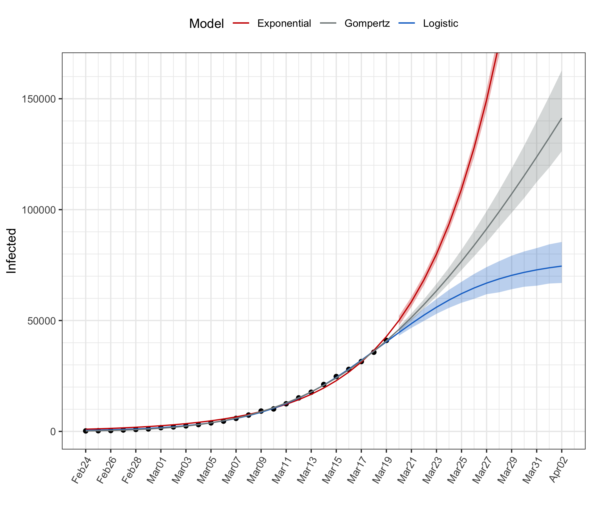
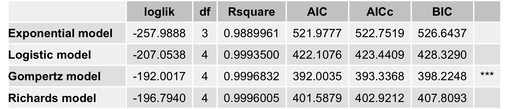
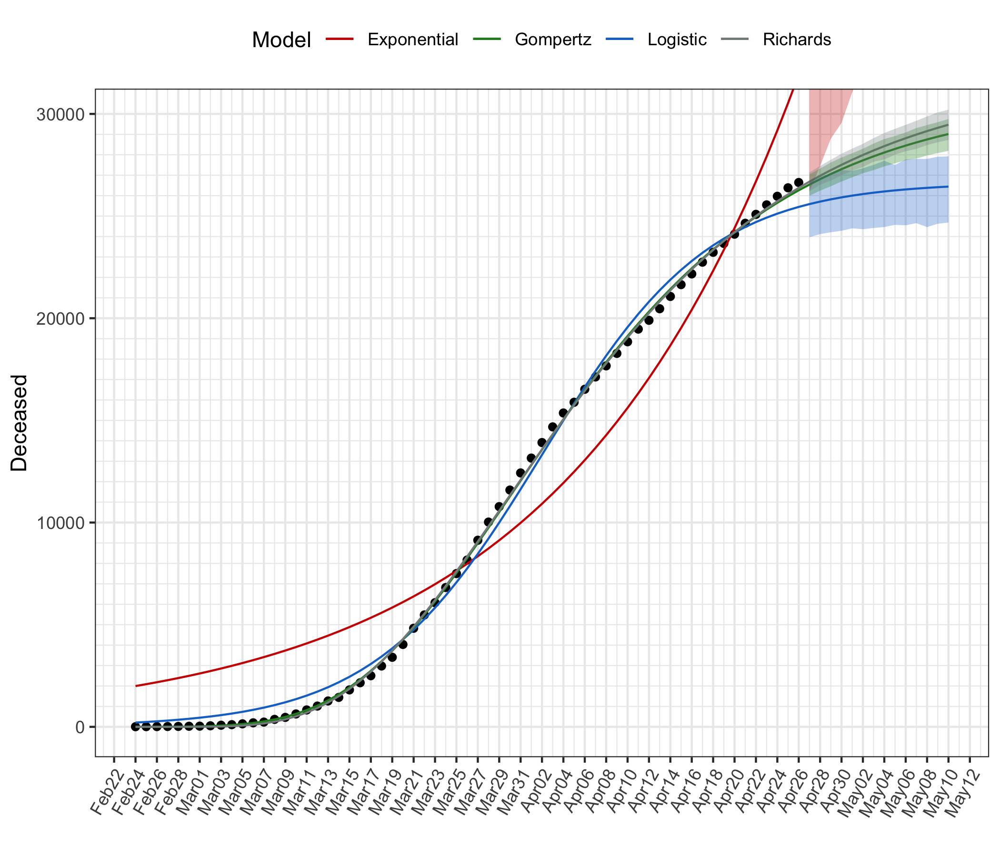
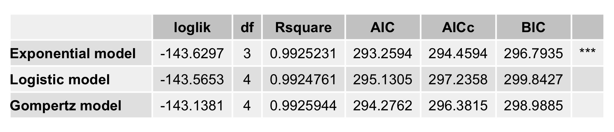
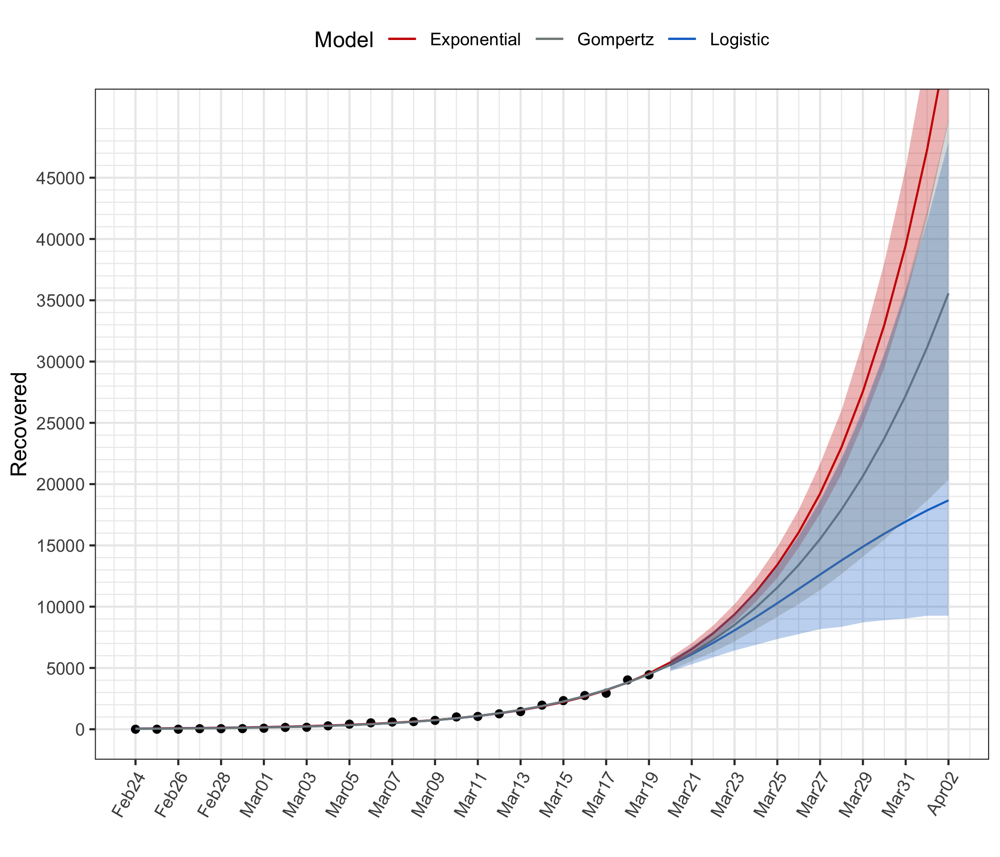

# Statistical Modelling of COVID-19 Outbreak in Italy

This repository contains the results of estimating simple nonlinear growth models to the data provided by the [Protezione Civile](http://www.protezionecivile.it/attivita-rischi/rischio-sanitario/emergenze/coronavirus) concerning the evolution of the total number of infected in Italy.   

Below a summary table of fitted models is reported with a graph of data points and predicted values for the next two weeks, with 95% prediction intervals obtained by moving block bootstrap simulation.

Data source: https://github.com/pcm-dpc/COVID-19  

For the full report see  [COVID-19-IT.html](https://htmlpreview.github.io/?https://github.com/luca-scr/COVID-19-IT/blob/master/COVID-19-IT.html)  
  
## Total infected

## Total deceased

## Total recovered

