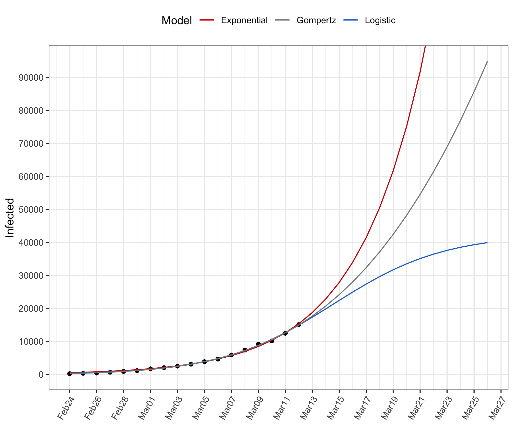

# Statistical Modelling of COVID-19 Outbreak in Italy

This repository contains the results of estimating simple nonlinear growth models to the data provided by the [Protezione Civile](http://www.protezionecivile.it/attivita-rischi/rischio-sanitario/emergenze/coronavirus) concerning the evolution of the total number of infected in Italy.   

Data source: https://github.com/pcm-dpc/COVID-19  

Full report available at [COVID-19-IT.html](https://htmlpreview.github.io/?https://github.com/luca-scr/COVID-19-IT/blob/master/COVID-19-IT.html)  
  

|                  |    loglik| df|   Rsquare|      AIC|      BIC|
|:-----------------|---------:|--:|---------:|--------:|--------:|
|Exponential model | -127.1082|  3| 0.9965806| 260.2163| 262.8875|
|Logistic model    | -119.4404|  4| 0.9983109| 246.8808| 250.4423|
|Gompertz model    | -117.3193|  4| 0.9986316| 242.6385| 246.2000|
