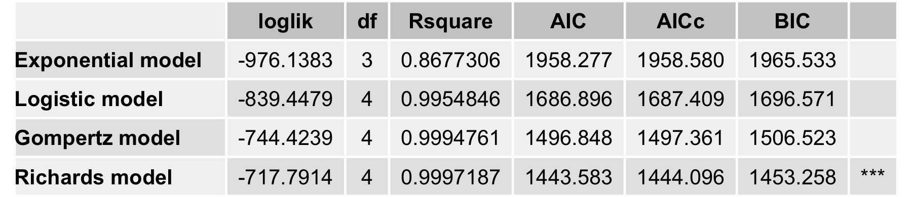
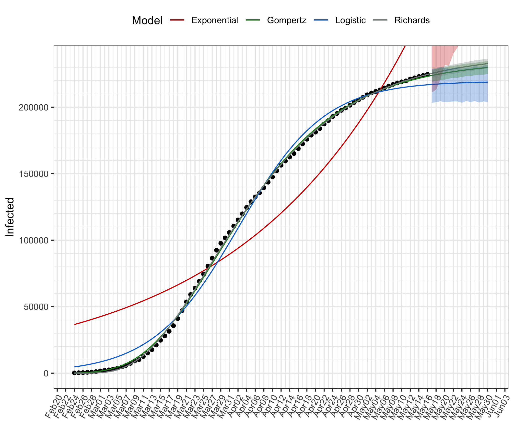
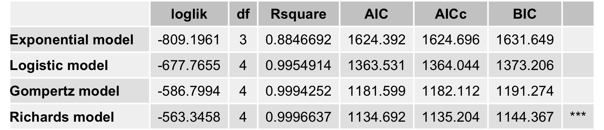
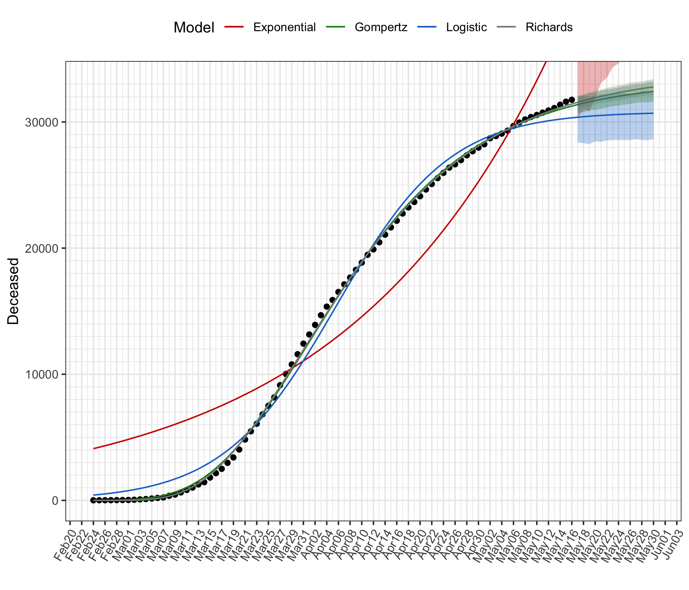
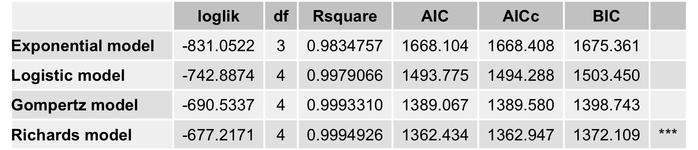
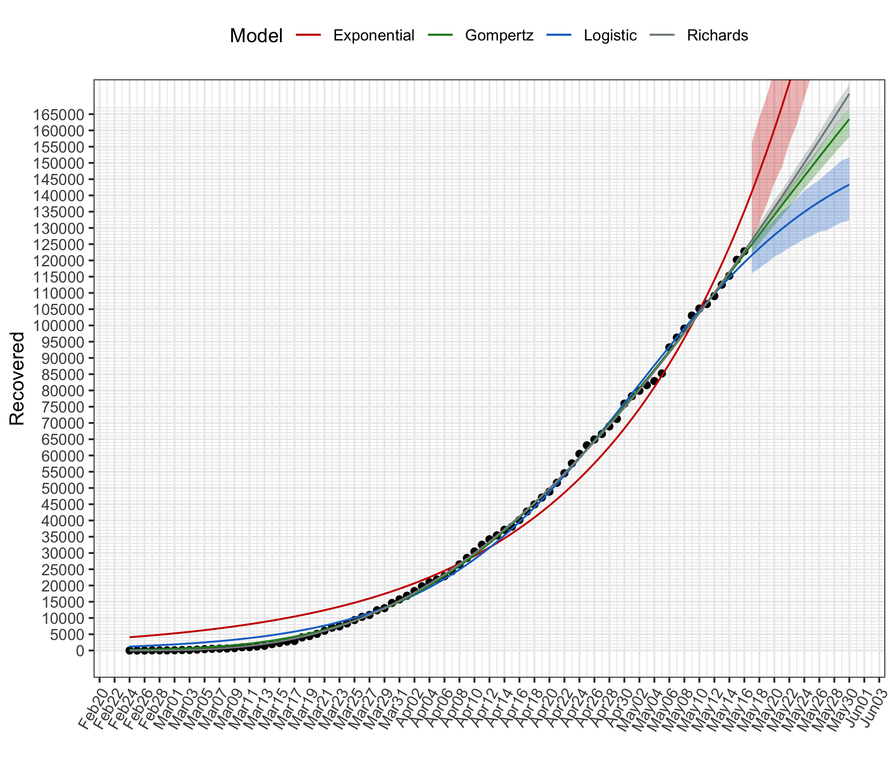

# Statistical Modelling of COVID-19 Outbreak in Italy

This repository contains the results of estimating simple nonlinear growth models to the data provided by the [Protezione Civile](http://www.protezionecivile.it/attivita-rischi/rischio-sanitario/emergenze/coronavirus) concerning the evolution of the total number of infected in Italy.   

Data source: https://github.com/pcm-dpc/COVID-19  

**Full reports** are available at the following links:

- [Italy](https://htmlpreview.github.io/?https://github.com/luca-scr/COVID-19-IT/blob/master/COVID-19-IT.html)  
  
- [Lombardia](https://htmlpreview.github.io/?https://github.com/luca-scr/COVID-19-IT/blob/master/COVID-19-Lombardia.html)  

- [Umbria](https://htmlpreview.github.io/?https://github.com/luca-scr/COVID-19-IT/blob/master/COVID-19-Umbria.html)  

  
Below a brief summary for Italy for total infected, total deceased and recovered. For each a table of fitted models is reported with a graph of data points and predicted values for the next two weeks, including 95% prediction intervals obtained by moving block bootstrap simulations.

## Total infected (Italy)

## Total deceased (Italy)

## Total recovered (Italy)

