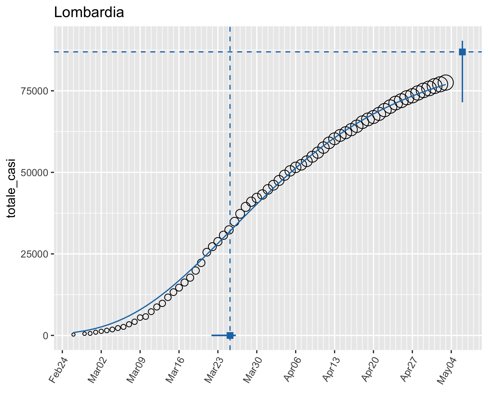
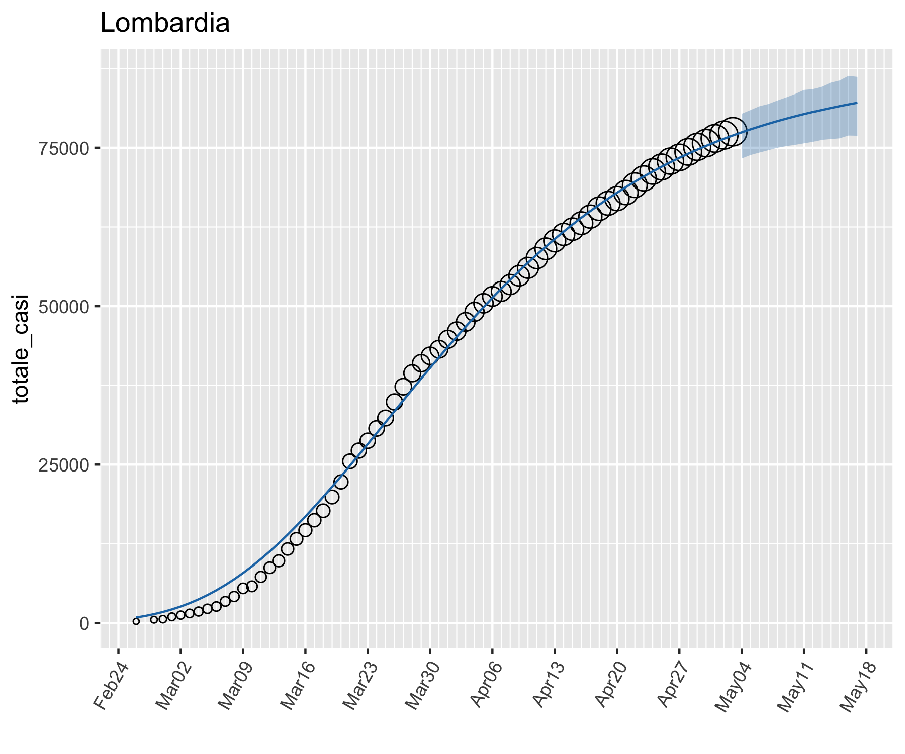
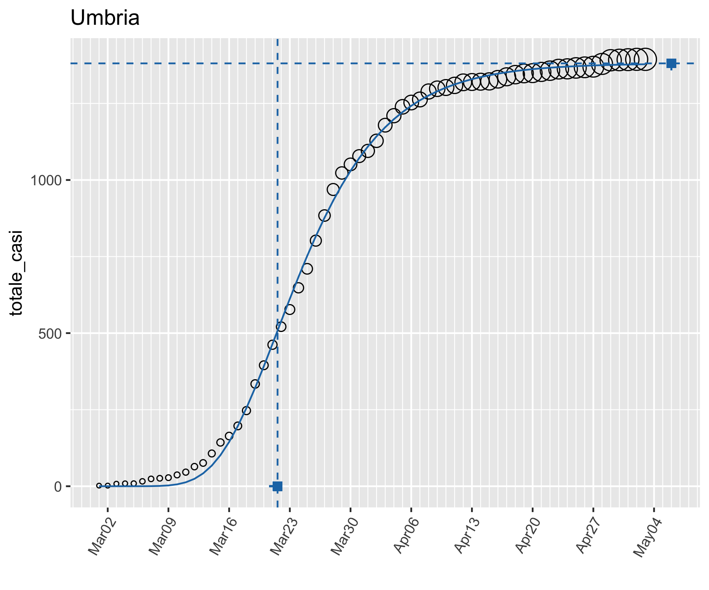
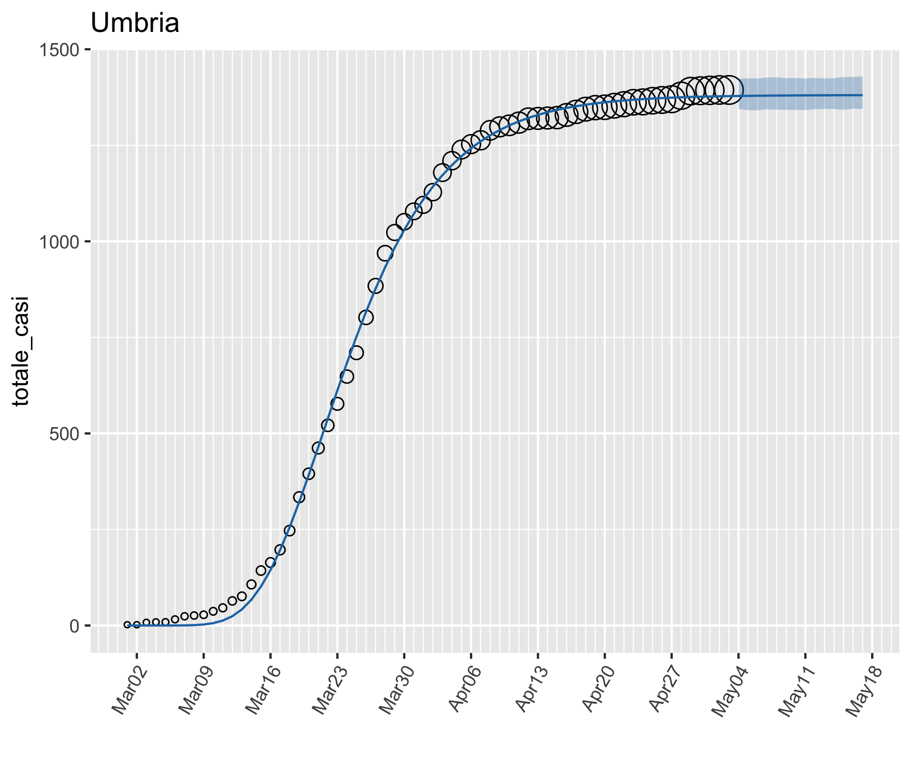
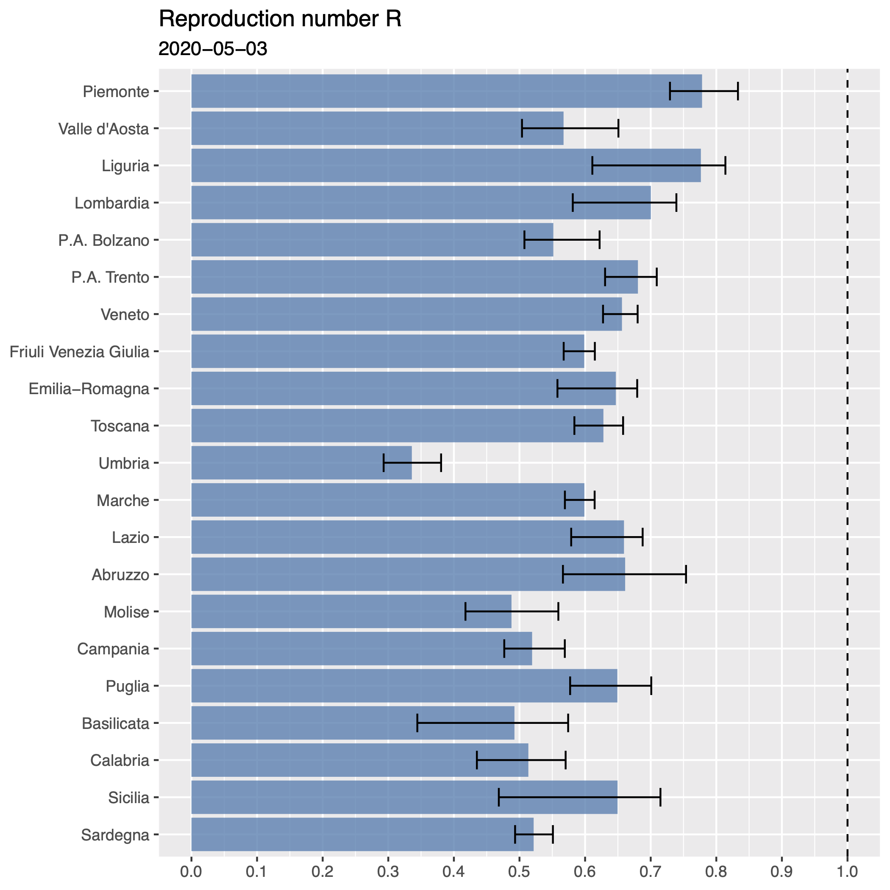

```{r echo=FALSE, eval=FALSE}
# convert to pdf
pagedown::chrome_print("/Users/luca/Stat/COVID-19-IT/UniPG_Post_COVID/UniPG_Post_COVID.html")
```

- Analisi del numero totale (cumulato) di casi positivi a COVID-19 per regione (dati Protezione Civile - ISS - Regioni).

- **Modello (non lineare) di crescita di Gompertz** 
$$
\mu(t) = \theta_1 \exp ( - \exp (-\theta_2 (t  - \theta_3) ) )
$$
  - $\theta_1$ : asintoto orizzontale (massimo valore curva epidemica)
  
  - $\theta_3$ : punto di flesso (punto massimo tasso di crescita - picco)
  
- Stima parametri tramite il *metodo dei minimi quadrati non lineari pesati*, con pesi proporzionali ai tamponi analizzati.

- Possibile utilizzo ai fini di policy:

  - **Previsioni**
  
  - Stima **effective reproduction number** $R_t$

- Stima dell'incertezza tramite il metodo **Moving Block Bayesian Bootstrap**.

- Oltre che per analizzare il numero di positivi, il modello può essere applicato anche per lo studio dell'andamento del numero di *ospedalizzati*, di *pazienti in terapia intensiva*, quantità particolarmente rilevanti nel c.d. Fase 2.

---

class: center, middle

```{R, echo=FALSE, out.width="90%"}

```

---

class: center, middle

```{R, echo=FALSE, out.width="90%"}

```

---

class: center, middle

```{R, echo=FALSE, out.width="90%"}

```

---

class: center, middle

```{R, echo=FALSE, out.width="90%"}

```

---

class: center, middle

```{R, echo=FALSE, out.width="80%"}

```
